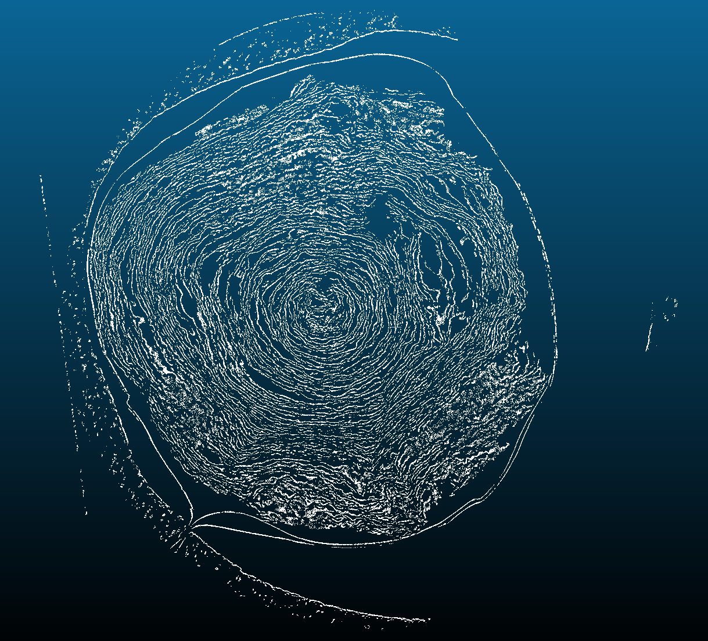
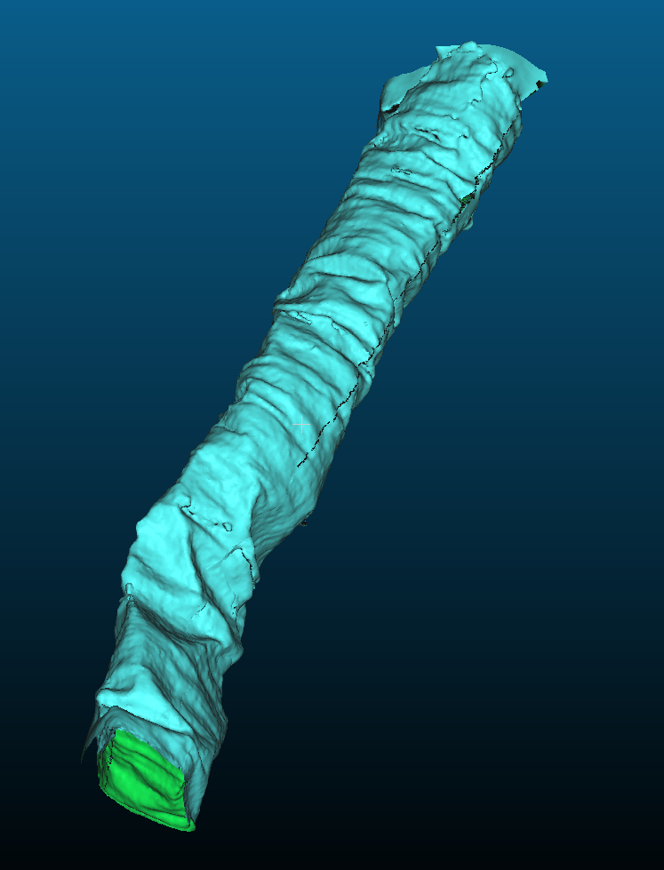
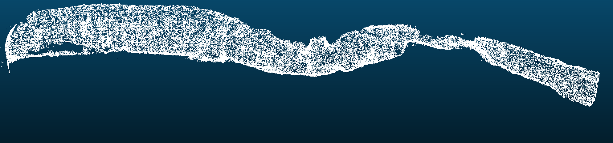

#  ThaumatoAnakalyptor

**ThaumatoAnakalyptor** is an advanced automatic segmentation pipeline designed for high-precision extraction of papyrus sheet segmentations from CT scans of ancient scrolls with minimal human intervention.


*0.5 meter long automatic segmentation of scroll 3.*

---

#  Vesuvius Challenge 2023 Grand Prize

This repository is part of the **First Place Grand Prize Submission** to the [Vesuvius Challenge 2023](https://www.scrollprize.org/) from Youssef Nader, Luke Farritor and Julian Schilliger.

Check out the **Ink Detection** of our winning Grand Prize submission in Youssef Nader's [Vesuvius Grand Prize Repository](https://github.com/younader/Vesuvius-Grandprize-Winner). He combines multiple Machine Learning techniques, like Domain Adaptation and TimeSformer to predict ink with the highest precision.

### Secondary Repositories of Julian Schilliger

This [fork](https://github.com/schillij95/volume-cartographer-papyrus) of **Volume Cartographer** introduces the **Optical Flow Segmentation** algorithms and important productivity improvements that enabled the generation of the manual scroll sheet segmentations used in the Grand Prize submission.

Ink labeling and segment inspection can efficiently be done with a purpose built tool named [Crackle Viewer](https://github.com/schillij95/Crackle-Viewer).

---


##  Overview

<p>
    
    
    <figcaption><i>Slice view trough the PointCloud volume of scroll 3 (left) and Sample mesh (right).</i></figcaption>
    </p>
    
    <figcaption><i>Stitched sheet PointCloud during the segmentation process. One half winding.</i></figcaption>
</p>

The core principle of ThaumatoAnakalyptor involves extracting 3D points on papyrus surfaces and grouping them into sheets. These sheets are then used to calculate a mesh that can be used for texturing the sheet's surface.

### Process
- **3D Derivative Analysis:** The method employs 3D derivatives of volume brightness intensity to detect papyrus sheet surfaces in CT scans. An intuitive explanation is that the side view of a sheet exhibits a bell curve in voxel intensities, allowing for precise detection of the sheet's back and front.
- **PointCloud Generation:** Local sheet normals are calculated from 3D gradients analysis of the scroll scan. By thresholding on the first and second 1D derrivative in sheet normal direction, the process identifies surface voxels/points, resulting in a detailed surface PointCloud volume of the scroll.

- **Segmentation and Mesh Formation:** The PointCloud volume is split into subvolumes, and a 3D instance segmentation algorithm clusters the surface points to instances of sheet patches. A Random Walk procedure is employed to stitch patches together into a sheet of points containing the 3D position and their respective winding number. Using Poisson surface reconstruction, the sheet points are then transformed into a mesh.

- **Texturing:** The mesh is unrolled to generate UV coordinates. Sub-meshes are created for easier texturing. Volume Cartographer's render pipeline textures the sheet's surface.


## Running the Code
This example shows how to do segmentation on scroll 3 (PHerc0332).

### Download Data
- **Scroll Data:**
    Download ```PHerc0332.volpkg``` into the directory ```<scroll-path>``` and make sure to have the canonical volume ID ```20231027191953``` in the ```<scroll-path>/PHerc0332.volpkg/volumes``` directory. Place the ```umbilici/scroll_<nr>/umbilicus.txt``` and ```umbilici/scroll_<nr>/umbilicus_old.txt``` files into all the ```<scroll-path>/PHerc0332.volpkg/volumes/<ID>``` directories.

    *Note*:
        To generate an ```umbilicus.txt``` for a scroll, make sure to transform the umbilicus coordinates from scroll coordinates ```x, y, z``` - where ```x,y``` is the tif 2D coordinates and ```z``` the tif layer number - into umbilicus coordinates ```uc``` with this formula: ```uc = y + 500, z + 500, x + 500```.

- **Checkpoint and Training Data:**
    Checkpoint and training data can be downloaded from the private Vesuvius Challenge SFTP server under ```GrandPrizeSubmission-31-12-2023/Codebase/automatic segmentation/ThaumatoAnakalyptor```. The checkpoint ```last-epoch.ckpt``` can also be downloaded from [Google Drive](https://drive.google.com/file/d/1gO8Nf4sCaA7r4dO6ePtt0SE0E5ePXSid/view?usp=sharing).

- **Segmentations:**
    The provided segmentations can be downloaded from the private Vesuvius Challenge SFTP server under ```julian_uploads/finished_segments/``` and ```julian_uploads/scroll3_segments/```.

### Execute the Pipeline
- **Setup:**
    Download the git repository:
    ```bash
    git clone --recurse-submodules https://github.com/schillij95/ThaumatoAnakalyptor
    ```
    Download the checkpoint ```last-epoch.ckpt``` for the instance segmentation model and place it into ```ThaumatoAnakalyptor/mask3d/saved/train/last-epoch.ckpt```. 
    
    Build and start the Docker Container:

    ```bash
    docker build -t thaumato_image -f DockerfileThaumato .
    ```
    The following commands might need adjustments based on how you would like to access your scroll data:
    ```bash
    xhost +local:docker

    ```
    ```bash
    docker run --gpus all -it --rm \
    -v <path_to_scroll>:/scroll.volpkg \
    -v <optional_alternative_path_to_scroll>:/scroll_alternative.volpkg \
    -v $(pwd)/:/workspace \
    -v /tmp/.X11-unix:/tmp/.X11-unix \
    -e DISPLAY=$DISPLAY \
    thaumato_image
    ```

- **GUI**
    ThaumatoAnakalyptor can be used eighter from command line or as a GUI.
    The GUI explains its usage in the help tab.
    After starting the docker image, The GUI can be started with the following command:
    ```bash
    python3 ThaumatoAnakalyptor.py
    ```

- **Precomputation Steps:**
    These are the instructions to use ThaumatoAnakalyptor from the command line.
    The precomputation step is expected to take a few days.

    The Grid Cells used for segmentation have to be in 8um resolution. ```generate_half_sized_grid.py``` is used for 4um resolution scans to generate Grid Cells in 8um resolution. If you have access to multiple GPU's, adjust the ```--num_threads``` and ```--gpus``` flags to speed up the process.
    ```bash
    python3 -m ThaumatoAnakalyptor.generate_half_sized_grid --input_directory <scroll-path>/PHerc0332.volpkg/volumes/20231027191953 --output_directory <scroll-path>/PHerc0332.volpkg/volumes/2dtifs_8um
    ```
    ```bash
    python3 -m ThaumatoAnakalyptor.grid_to_pointcloud --base_path "" --volume_subpath "<scroll-path>/PHerc0332.volpkg/volumes/2dtifs_8um_grids" --disk_load_save "" "" --pointcloud_subpath "<scroll-path>/scroll3_surface_points/point_cloud" --num_threads 4 --gpus 1
    ```
    ```bash
    python3 -m ThaumatoAnakalyptor.pointcloud_to_instances --path "<scroll-path>/scroll3_surface_points" --dest "<scroll-path>/scroll3_surface_points" --umbilicus_path "<scroll-path>/PHerc0332.volpkg/volumes/umbilicus.txt" --main_drive "" --alternative_ply_drives "" --max_umbilicus_dist -1
    ```

- **Segmentation Steps:** Additional details for each segmentation step are provided in the [instructions](ThaumatoAnakalyptor/instructions.txt) document.
    First, pick a ```--starting_point```.
    The first time the script ```Random_Walks.py```  is run on a new scroll, flag ```--recompute``` should be set to 1. This will generate the overlapping graph of the scroll. For subsequent runs, flag ```--recompute``` should be set to 0 to speed up the process. Flag ```--continue_segmentation``` can be set to 1 if there already is a previous segmentation with the same starting point that you would like to continue.
    ```bash
    python3 -m ThaumatoAnakalyptor.Random_Walks --path "<scroll-path>/scroll3_surface_points/point_cloud_colorized_verso_subvolume_blocks" --starting_point 3113 5163 10920 --sheet_k_range -3 3 --sheet_z_range -10000 40000 --min_steps 16 --min_end_steps 4 --max_nr_walks 300000 --continue_segmentation 0 --recompute 1 --walk_aggregation_threshold 5
    ```

    For subsequent continuations of a segmentation, for example:
    ```bash
    python3 -m ThaumatoAnakalyptor.Random_Walks --path "<scroll-path>/scroll3_surface_points/point_cloud_colorized_verso_subvolume_blocks" --starting_point 3113 5163 10920 --sheet_k_range -3 3 --sheet_z_range -10000 40000 --min_steps 16 --min_end_steps 4 --max_nr_walks 300000 --continue_segmentation 1 --recompute 0 --walk_aggregation_threshold 5
    ```

- **Meshing Steps:** 
    When you are happy with the segmentation, the next step is to generate the mesh. This can be done with the following commands:
    ```bash
    python3 -m ThaumatoAnakalyptor.sheet_to_mesh --path_base <scroll-path>/scroll3_surface_points/3113_5163_10920/ --path_ta point_cloud_colorized_verso_subvolume_main_sheet_RW.ta --umbilicus_path "<scroll-path>/PHerc0332.volpkg/volumes/umbilicus.txt"
    ```
    ```bash
    python3 -m ThaumatoAnakalyptor.mesh_to_uv --path <scroll-path>/scroll3_surface_points/3113_5163_10920/point_cloud_colorized_verso_subvolume_blocks.obj --umbilicus_path "<scroll-path>/PHerc0332.volpkg/volumes/umbilicus.txt"
    ```
    The ```scale_factor``` depends on the resolution of the scroll scan. For 8um resolution, the scale factor is 1.0. For 4um resolution, the scale factor is 2.0.
    ```bash
    python3 -m ThaumatoAnakalyptor.finalize_mesh --input_mesh <scroll-path>/scroll3_surface_points/3113_5163_10920/point_cloud_colorized_verso_subvolume_blocks_uv.obj --cut_size 40000 --scale_factor 2.0 
    ```

- **Texturing Steps:** 
    VC rendering is used to generate the textured sheet. Place the folder ```working_<starting_point>``` into the ```PHerc0332.volpkg``` directory. Enter ```working_<starting_point>```. Then run the following commands:
    ```bash
    export MAX_TILE_SIZE=200000000000
    ```
    ```bash
    export OPENCV_IO_MAX_IMAGE_PIXELS=4294967295
    ```
    ```bash
    export CV_IO_MAX_IMAGE_PIXELS=4294967295
    ```
    ```bash
    vc_render --volpkg <scroll-path>/PHerc0332.volpkg/ --volume 20231027191953 --input-mesh point_cloud_colorized_verso_subvolume_blocks_uv.obj --output-file thaumato.obj --output-ppm thaumato.ppm --uv-plot thaumato_uvs.png --uv-reuse --cache-memory-limit 150G
    ```
    ```bash
    vc_layers_from_ppm -v ../ -p thaumato.ppm --output-dir layers/ -f tif -r 32 --cache-memory-limit 150G
    ```
    Alternatively, rendering from ppm can be done with GPU acceleration:
    ```bash
    python3 -m ThaumatoAnakalyptor.ppm_to_layers <path_to_ppm> <path_to_volume_grids>
    ```

- **Resource Requirements:** RTX4090 or equivalent CUDA-enabled GPU with at least 24GB VRAM, 196GB RAM + 250GB swap and a multithreaded CPU with >32 threads is required. NVME SSD is recommended for faster processing. Approximately twice the storage space of the initial scroll scan is required for the intermediate data.

### Training 3D instance segmentation (advanced)
If you would like to train the 3D instance segmentation model refer to [Mask3D](ThaumatoAnakalyptor/mask3d/README.md) and [these additional instructions](ThaumatoAnakalyptor/mask3d/install_commands.txt).
Make sure to download the provided training data ```3d_instance_segmentation_training_data```, preprocess the data and place it in the appropriate directories.

### Debugging
- **3D Visualization:** For debugging and visualization, CloudCompare or a similar 3D tool is recommended.

## Disclaimer
- Paths in the script might need adjustment as some are currently set for a specific system configuration.

## Known Bugs
- Recto and verso namings are switched.
- Starting points should be at the very bottom side of the sheet in a z slice trough the scroll.

## TODO
- Test Multi GPU
- Test Dockerization

## Contribution and Support
- As this software is in active development, users are encouraged to report any encountered issues. I'm happy to help and answer questions.


**Happy Segmenting!**
